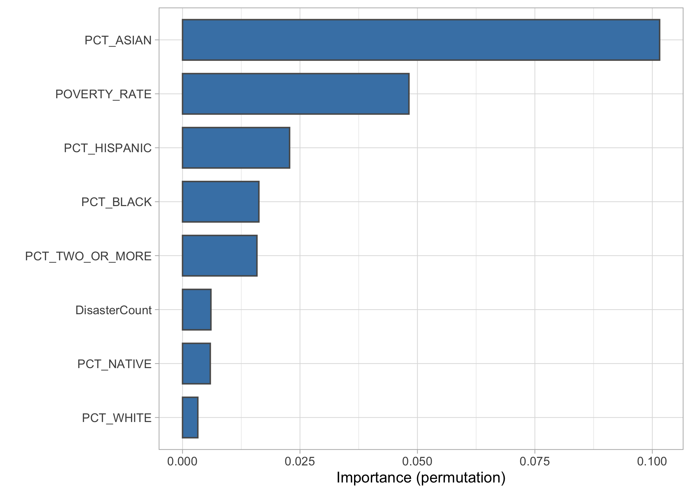
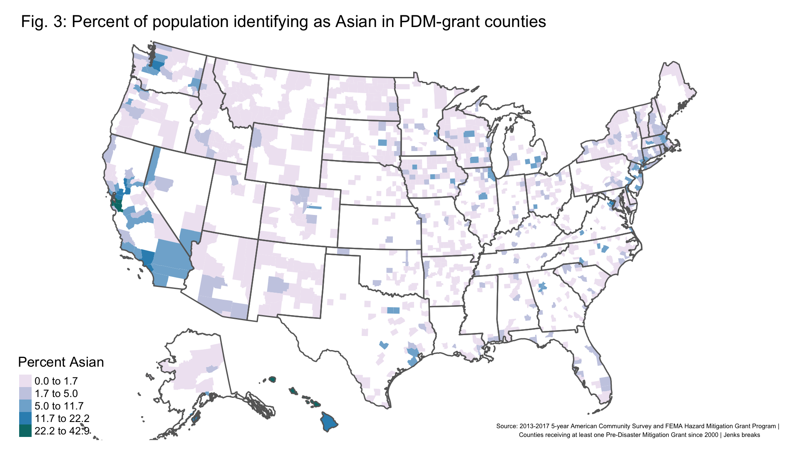
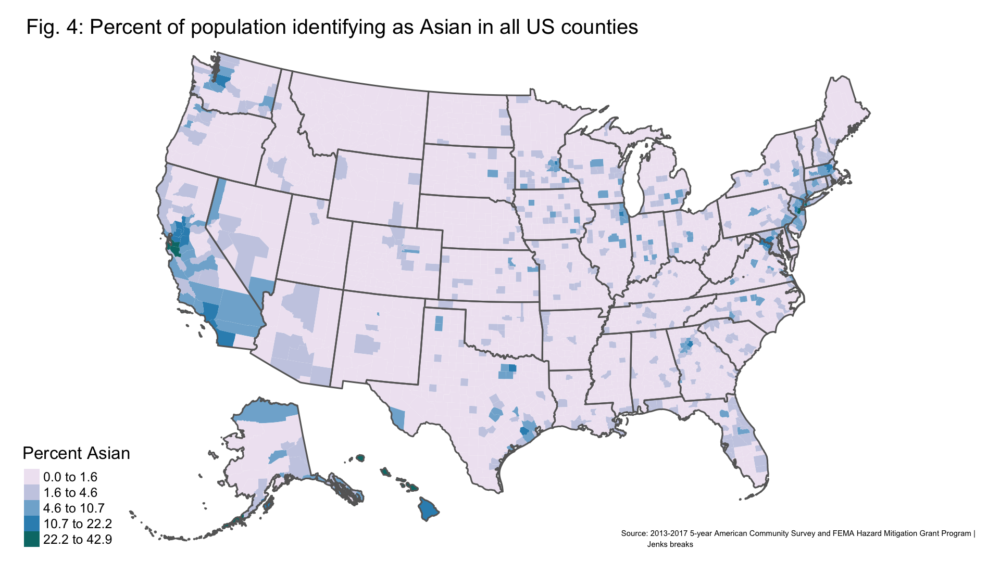
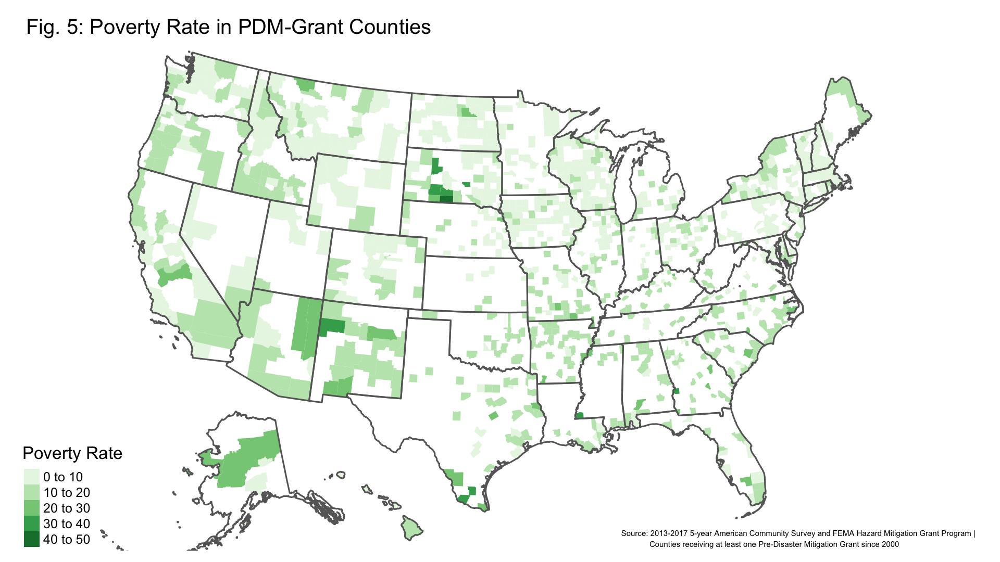
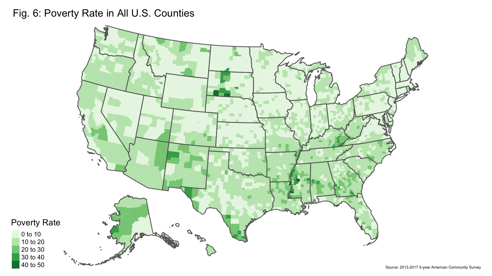

```{r setup, include=FALSE}
knitr::opts_chunk$set(echo = TRUE)
require(knitr)
require(tidyverse)
require(here)
here("summarystats.png", "pct_asian_PDM_counties.png", "pct_asian_all_counties.png", "variable_importance.png", "disaster_count_PDM_counties.png", "disaster_count_all_counties.png", "poverty_rate_all_counties.png", "poverty_rate_PDM_counties_map.png")
```

## Introduction 

This project aims to investigate the economic and demographic characteristics of counties receiving Pre-Disaster Mitigation (PDM) grants from the Federal Emergency Management Agency (FEMA) as part of the agency's Hazard Mitigation Grants Program. 

This project compiles data from FEMA and the U.S. Census Bureau on counties that have and have not received PDM grants since the program's inception in FY 2000, and uses data visualization and machine learning methods to investigate the variables that best determine whether a county is more to have received a PDM grant. Preliminary results indicate the percentage of people of Asian descent living in a county is by far the most predictive variable for receiving a grant, followed by the poverty rate, although there are significant limitations to the model in its current form. 

This report will first discuss background on disaster mitigation programs in the United States and detail the data sets used in this analysis. Next, I will enumerate the steps taken to analyze the data and share initial results. To conclude, I will discuss the successes and shortcomings of this project, and options for improving and expanding the analysis in the future. 

## Research question and Background

Are FEMA PDM funds more or less likely to flow to areas that have the greatest need of such assistance? 

This research question is timely and relevant because in the last several decades, extreme weather events in the United States have grown more frequent and more costly [@NOAA]. Low-income households tend to suffer disproportionately as a result of natural disasters, both because they lack the financial resources to adequately prepare in advance of a disaster, and also because low-income housing tends to be built in areas that are more prone to flooding, making recovery more challenging [@WaPo]. The bulk of federal assistance to communities affected by extreme weather comes in supplemental spending bills enacted after a disaster has already struck, despite the fact that every dollar invested in federal pre-disaster resilience programs reduces post-disaster expenditures by $6 [@Mitigation]. The PDM program is one of the only federal grant programs available to support resilience planning and infrastructure improvements in advance of a disaster, and is open to all U.S. states, territories, recognized tribes, counties, and localities, regardless of disaster status [@PDM]. 

This project fits squarely into several emerging areas of research into climate change adaptation and economic inequality. An analysis of 40,000 flood-prone properties purchased through FEMA's voluntary buyout program found that, contrary to policymakers' expectations, higher-income counties were more likely to conduct buyouts than low-income counties. However, within those higher-income counties, the bought-out properties were more likely to be in areas of relatively lower income or higher racial diversity, raising equity concerns around climate adaptation in the home buyout program [@Buyouts]. Another study focusing specifically on the effects of Hurricanes Katrina and Rita found that households that were forced to relocate to a different county following those disasters experienced a significant loss of income as a result, with lifetime earnings declining an average of $33,821 compared to households that did not relocate [@Demographics]. Helping communities improve their ability to weather natural disasters before they strike could therefore be important to preventing further increases in regional income inequality as a consequence of climate change.

## Data 

This project pulls data from three sources:

* FEMA's database of federally declared disasters, from 1953 to present [@Disasters],
* FEMA's database of all project awards given under the Hazard Mitigation Grant Program, of which the PDM program is a part [@HMAP];
* The U.S. Census Bureau's American Community Survey (ACS) five-year estimates for 2012-2017, which contains the most detailed and up-to-date demographic information about U.S. persons and communities [@ACS].
  
This project analyzes data at the County-Grant Status level. The dependent variable for the machine learning analysis is the county's grant status (whether it has received a PDM grant or not, coded as "Grant" and "No_Grant" and derived from the Hazard Mitigation Grant Program database). The independent variables are the total disaster count for each county since 2000 (derived from FEMA's disaster declarations database); the poverty rate for each county as of 2017 (from the ACS); and the percentage of people in each county identifying as white, Black, Native American, Asian, two or more races, and Hispanic of any race (also from the ACS). 

Both FEMA datasets were imported into R using the `read.csv` function, after multiple attempts to access the data using FEMA's API ran into technical difficulties, largely related to the agency's decision to limit API calls to 1,000 entries, even when using a valid API key. Since both the disaster declaraction and Hazard Mitigation Grant Program databases have tens of thousands of observations, it was simpler to load the full data sets and use the `filter()` function from the `dplyr` package to select only data from the PDM program since 2000 and only disaster declarations since 2000. I also used the `group_by`, `add_count()` and `slice()` functions in combination to group disaster declarations by county FIPS code, tally the number of disaster declarations since 2000 in each county, and keep only one total count of disasters per county in my final data set [@dplyr].

ACS data was acquired using the `tidycensus` package, which enables easy access to the APIs for Census surveys [@tidycensus]. Because `tidycensus` assigns a 5-digit GEOID (based on FIPS codes) to each county and FEMA put state and county FIPS codes in separate columns, I had to further manipulate my FEMA datasets to create matching 5-digit GEOIDS before I could join all my data together into one set. 

My final data set (`dat_all`) for analysis contained 4,737 observations, whereas there are only 3,220 counties and county-equivalent units in the ACS data. The discrepancy arises in part because FEMA also gives grants to tribal areas that are not included in the ACS data I pulled, and also because some counties received multiple PDM grants in the period since 2000 and are included multiple times in the data. I chose not to collapse the grants into a count of the total number of PDM grants received for each county, which may have affected the outcomes in my machine learning models by over-emphasizing the characteristics of counties that received multiple PDM grants.


## Analysis 

Prior to conducting any statistical or machine learning analysis, I split my `dat_all` data set into a `training` data set containing a random selection of 75 percent of the observations, and a `testing` data set containing the remaining randomly selected 25 percent of observations. This step is critical to avoid having the models over-fit to the data, and also helps test the accuracy of the best performing model on previously unseen data. I also set a seed and split my data into five roughly equal folds (of 710 or 711 observations each), so that my model runs would be replicable and additional random error would not creep in to my models. 

My `training` data set contained 3,354 observations. NAs were present for all of my independent variables, with different meanings: for the DisasterCount variable, which tallied the number of declared disasters, an "NA" indicated there had been 0 declared disasters in that county since 2000, whereas an "NA" for any of the ACS-derived variables was the result of a GEOID not being present in the Census data set, as was the case for tribal areas. I once again used `dplyr()` functions to replace "NA" with 0 for the DisasterCount variable, resulting in the following distributions of independent variables:

```{r, echo = FALSE, fig.pos = "H", fig.align = "center", out.width="60%"}

```

The discrepancy between the number of observations (N) with an associated DisasterCount and the number for the ACS-derived variables illustrates the number of NA values still present in the ACS data. I further preprocessed my data for use in my machine learning models by imputing the missing demographic variables using the median value from each set. I  also repeated these steps on my `testing` data set, so that NAs in DisasterCount were replaced by zeroes, and missing demographic variables were imputed from the medians [@recipes].

Ultimately, this project presents a classification problem: Did a county receive a grant ("Grant" outcome), or not ("No_Grant" outcome)? I therefore ran models appropriate to a classification problem on my `training` data, including logistic regression, K-nearest neighbors, classification and regression trees (CART), random forest, and support vector machines [@caret] [@rpart].

## Results

Of all the models, the random forest performed best, with an ROC of 0.72 at 95 percent confidence [@ranger]. Even the random forest, then, is not a particularly strong model for classifying whether a county is likely to have received a grant or not based on the independent variables I selected. 

I used the `vip` package to determine which independent variables were most important in the random forest model [@vip]:

```{r, echo = FALSE, fig.pos = "H", fig.align = "center", out.width="50%"}

```

The above variable importance plot shows that the percentage of people of Asian descent was far and away the most important variable in classifying whether a county received a grant or not, followed by the poverty rate. 

Finally, I ran the best-performing random forest model on my `testing` data set, resulting in an ROC of 0.80, meaning the model performed slightly better on my `testing` data than on my `training` data. 

Because the PDM grants flow to specific geographies, using mapping tools should help communicate key socioeconomic differences between counties that did and did not receive PDM grants, and also identify potential gaps in PDM spending. 

I used my `training` data set to create several maps: 

* The percentage of people of Asian descent in PDM-grant counties (Figure 3)
* The percentage of people of Asian descent in all US counties (Figure 4)
* The poverty rate in PDM-grant counties (Figure 5)
* The poverty rate in all US counties (Figure 6)
* The number of disaster declarations since 2000 in PDM-grant counties (Figure 7)
* The number of disaster declarations since 2000 in all US counties (Figure 8) 

All maps were rendered using `rnaturalearth` [@rnaturalearth], which provides shapefiles for specified geographies, and `tmap` [@tmap], which renders the maps. All geographic data came from the ACS via `tidycensus` [@tidycensus]. 

Comparing the percentage of people of Asian descent in PDM counties with the United States as a whole using these map representations shows that the Asian demographic variable may actually be representing something more like 'population centers'. It appears in Fig. 4 that people of Asian descent are heavily clustered in large and midsize metro areas in California, around Seattle, in and around Houston and Dallas, in the Northeast, as well as throughout Hawaii. Many of these same counties also received PDM grants. Meanwhile, the many rural counties that did not receive PDM grants (Fig. 3) are also not home to very many people of Asian descent (Fig 4). These maps help illustrate why the random forest model found the PCT_ASIAN variable so predictive. 

```{r, echo = FALSE, fig.pos = "H", fig.align = "center", out.width="100%"}

```

```{r, echo = FALSE, fig.pos = "H", fig.align = "center", out.width="100%"}

```

Examining maps of the poverty rate in PDM counties, compared to the United States as a whole, drives home why the random forest model found the poverty rate less predictive in classifying counties by PDM grant status. There are large areas, notably in the Southeast, with relatively high poverty rates (Fig 6) but low incidence of PDM grants (Fig 5).

```{r, echo = FALSE, fig.pos = "H", fig.align = "center", out.width="100%"}

```

```{r, echo = FALSE, fig.pos = "H", fig.align = "center", out.width="100%"}

```

Given the uneven geographic distribution of PDM grants, as illustrated in Figs. 3 and 5, it's worth investigating whether the non-PDM counties appear to be less disaster prone than the PDM counties. Once again, mapping tools help tease out the trends:

```{r, echo = FALSE, fig.pos = "H", fig.align = "center", out.width="100%"}

```

```{r, echo = FALSE, fig.pos = "H", fig.align = "center", out.width="100%"}

```

In fact, there appear to have been quite a lot of disaster declarations in some states where many counties have never been awarded a PDM grant, including Louisiana, Florida, Texas, Oklahoma, Kansas, and Nebraska. The difference between the number of counties that have received a PDM grant in Iowa compared to neighboring Nebraska is particularly striking: The two states appear to have experienced a similar number of disaster declarations across counties, and yet many more counties in Iowa have been awarded PDM grants. 

## Discussion 

The goal of this project was to better understand the characteristics of counties that receive PDM grants along both socioconomic dimensions and the counties' propensity for experiencing disasters. The project was partially successful: I was able to identify variables that are more predictive of whether a county has received a PDM grant, but as noted in the preceding section, it's possible that the PCT_ASIAN variable is actually acting as a proxy for population centers in many instances, and it may be the case that population size is actually a more influential variable. I would need to collect more ACS data and re-run the models to see whether including population data changes my results. 

My decision not to collapse counties that received multiple PDM grants into a single County-Grant Outcome observation may also have over-fit the models to variable distributions that were present in those counties, skewing the results. 

I used all the tools I intended to in my data analysis, with the exception of using the FEMA API to pull together disaster declaration and PDM data, as discussed previously. I did have to create a new GitHub repository partway through the project, after accidentally creating a branch and subsequently encountering issues committing changes. 

Given more time, I would make a number of adjustments to this project and pursue additional research questions. To begin, it would be useful to include more socioeconomic data from the Census Bureau, including more detailed income data and population counts. It could also be valuable to incorporate variables related to the quality of governance and political party control. Political and governance factors could help in understanding why more counties in Iowa have received PDM grants than in Nebraska, despite the two states' demographic and disaster count similarities, for instance. 

My choice to tally all disasters declared in each county since 2000 also removed a source of variation that would be worth re-introducing and expanding. Disaster declarations are not all created equal: Depending on the disaster type, different kinds of federal assistance can be triggered. Tallying the total number of all disasters also removes information about the kinds of disasters a county is moost prone to (floods, fires, hurricanes, and so on). Most notably, simply tallying the number of disasters declared in each county doesn't indicate how _severe_ the disasters were, and so incorporating data on economic damages could be a valuable addition to this project. 


## References